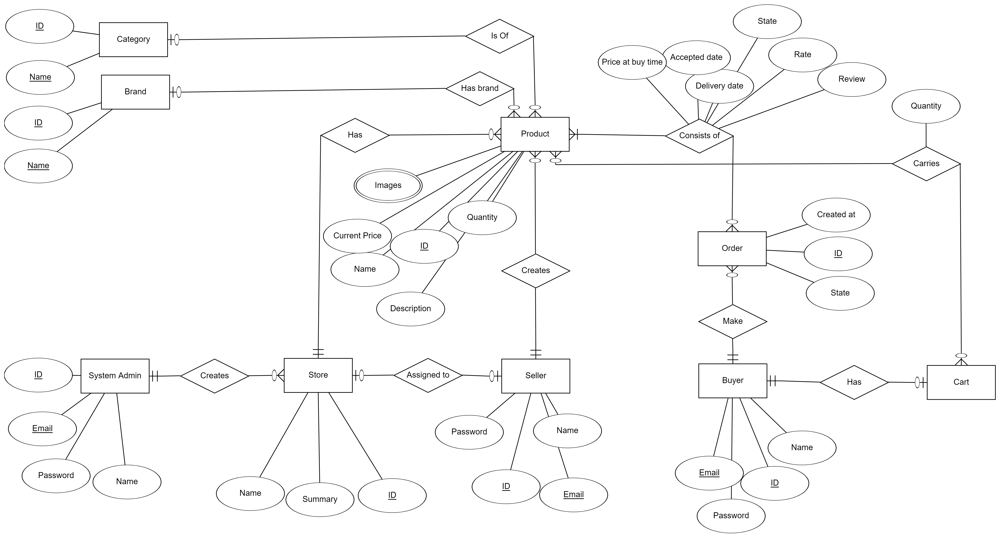

# Ruby E - Commerce

This is our implementation of the Ruby on Rails project submitted to the information technology institute (ITI), in this document we will highlight all the details of the project.

# Introduction

The project has some implementation decisions like multiple authenticatable models, how the ordering system behaves, the seller registrations behavior, etc..

We will discuss them each one by one in their sections so that being said let's

# Get started

- Clone the repository 
- Run `rails bundle install`
- Run `rails db:migrate`
- Run `rails server`
- That's it the project is up and running

# Database

First let's preview the ERD of our database then we will discuss our decisions about it 

For a better view you can find the image [here](./ERD.png)

Let's start with the users of the system we have 3 types of users Buyers/Sellers/System admins

Each user is an authenticatable model created using [devise gem](https://github.com/heartcombo/devise) which eased the customization of the views and controllers

## Buyer Model 
The buyer model has a special behavior that once it's created in the system (A buyer registers) A cart model is associated to the buyer to hold his products before checkout we opted to save it in the database rather than using cookies or local storage for a couple of reasons 

- Like souq/amazon if you add something to your cart it persists in if you visit the site from multiple devices
- The active record ORM allows ease of use to manipulate the database and finding the cart can be further eased by indexing the cart model key column this allows for faster select queries

That was our reasoning behind why are carts a database model

## Seller Model
The seller can register just like the buyer *BUT* he cannot add product until he has a store and he can only be assigned a store using the system admin, So a seller is basically a guest until a store is assigned to him

## System admin
The admins that can create a store and once a store is created a seller has to be assigned to it also the admins are able to create Brands & Categories which are used as search queries

## Product
The seller can create a product where a product *MUST* have a brand, category and a store sold in we opted to have a separate price column in the order because if the seller chooses to update the product's price at any point in time the past orders will not be updated and will have their own prices

# Business logic
When the buyer adds a product to the cart he can view it and update its quantity or delete it once he checks out a couple of things happen

- The cart items are queried are they in stock or not
- If they are available an order instance is created 
- The order instance is associated with each cart item but as an order item for each seller has his own item to accept/refuse 
- The cart is emptied from all items and the ordering is done

This allows each product to have its own state confirmed/denied by the its seller and the order to have a global state of done/denied 

# Development
We used some gems in our development 

- Devise gem to allow authentication of buyer/system admin/seller models
- Carrier wave to store public data (images) of products and handle uploads

we used the command `rails generate scaffold <any name>` to build our project which provided us with the views/controllers/routes/migrations and basic CRUD operations in the controllers 